## 안녕하세요!  
단순한 구현이 아닌 최적화된 설계를 기반으로 문제를 해결하는 개발자 장준용입니다.

- Express.js , Spring Boot 와 같은 프레임워크를 이용해, API를 개발하고, AWS, Docker를 이용해, 서버를 구축한 경험이 있습니다.

- 영상 요약 서비스, 커밋 기반 TIL 생성 서비스, 중고 대여 중계 플랫폼 등의 다수의 프로젝트에 Backend로 참여했으며, 모듈화, 추상화, 반정규화  등의 요소를 사용하여, 코드 가독성을 높이고, 책임을 분산시키는 등의 최적화를 진행했습니다.

- 단순한 개발 뿐만 아니라 해커톤, 개발 경진 대회 등에 참여하여, 수상하는 등의 성과를 얻었습니다.

- 여러 기술을 단순히 도구로 보고 사용하는 것이 아닌, 그 기술을 이해하고 활용하는 개발자입니다.

---

## 🛠️ Tech Stacks  

## 🧑‍💻 Contact me  

## 📊 GitHub Stats  

  

